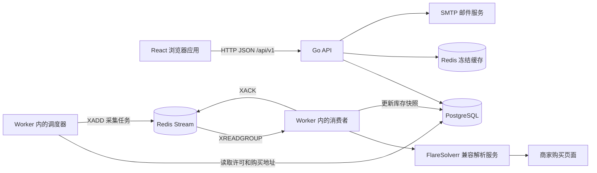

# VPS Monitor 技术文档

核对日期：2026-09-19。依据：当前工作区源代码，核对起点为提交 `c1d2db8`（完善 redis stream）。本文档描述实际实现，不代表所有功能已通过线上验收。

## 阅读入口

| 文档 | 内容 | 适用读者 |
| --- | --- | --- |
| [后端技术文档](backend.md) | 分层、认证、业务规则、数据库、扩展方式 | 后端开发 |
| [前端技术文档](frontend.md) | 页面、状态、HTTP 层、表单、库存展示 | 前端开发 |
| [HTTP 接口说明](api.md) | 路由清单、请求响应、权限、错误码 | 前后端联调 |
| [OpenAPI](openapi.yaml) | 机器可读 HTTP 契约 | 接口工具、客户端开发 |
| [库存采集与 Redis Stream](collection.md) | 调度、消息、采集器、入库、ACK、Pending | 后端和运维 |
| [部署与运行](deployment.md) | 环境变量、初始化、启动、容器、排障 | 开发和运维 |
| [已知问题与验证记录](known-issues.md) | 契约差异、实现限制、实际验证结果 | 维护者 |
| [前端采集联调速查](frontend-collection-sync.md) | 采集开关与浏览器展示边界 | 前端联调 |

先读本文，再按职责读前端或后端文档，最后结合接口和已知问题开发。文中的“当前行为”来自代码；“建议”“待完善”不代表已完成。

## 系统边界

项目管理 VPS 商家、套餐及其库存快照，并提供账户和后台管理。这里的监控是商家购买页面的库存采集，不是 VPS 主机 CPU、内存、网络等运行指标采集。



- 前端仅通过 HTTP API 读写业务，不连接数据库、Redis、SMTP 或解析服务。
- API 与 Worker 是不同入口、不同进程。API 管理数据和返回库存；Worker 调度、采集并写库存。
- 当前 Worker 将调度器、消费者、Pending 清理器放在同一进程，尚未拆出独立调度服务。
- 商家和 VPS 的 `enabled` 控制业务启用/公开展示，`collection_enabled` 保存采集许可。
- 采集已有实现，但当前两个采集器只明确识别无货；Pending 清理直接 ACK，限制见采集文档。
- 没有库存历史、立即采集、Worker 在线状态、订阅通知、评论、设备会话管理 API。

## 技术栈与目录

后端 `go.mod` 声明 Go 1.25.0，使用 Gin 1.11、GORM 1.31、go-redis/v9、JWT v5、bcrypt、decimal、goquery。部署文件使用 PostgreSQL 17 和 Redis 8 镜像。前端声明 React 18、TypeScript 5、Vite 5、React Router 6、Tailwind CSS 3；准确安装版本以锁文件为准。

```text
backend/                Go 模块，API、Worker、CLI、业务、数据库迁移
frontend/               React SPA，页面、组件、HTTP 客户端、测试
docs/                   当前技术文档
docker-compose.vps.yaml 镜像部署编排，依赖外部反向代理网络
.github/workflows/      镜像发布流程
```

## 文档维护规则

1. 实现事实按路由、请求/响应类型、service、SQL、前端调用逐层核对，不能仅凭旧注释判定状态。
2. HTTP 变更同步 `openapi.yaml`、`api.md`、前端 `src/types` 和 `src/api`；内部消息字段不自动进入 HTTP。
3. 数据库变更新增迁移，不改写已执行基线。
4. 旧前端设计和重构骨架文档已移除；历史设计可通过 Git 历史查阅，当前开发与验收使用本索引中的文档。
5. 本次仅更新文档，不修改应用逻辑。缺口集中记录在 [known-issues.md](known-issues.md)。
