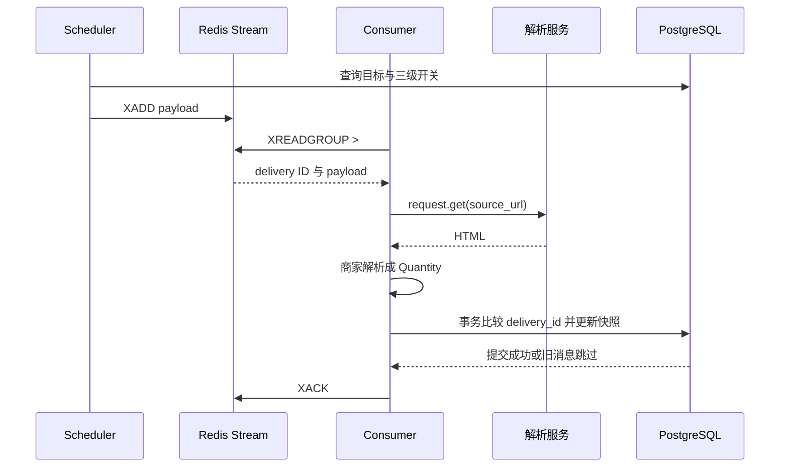

# 库存采集与 Redis Stream

核对日期：2026-09-19。本文描述已存在的采集实现，包括不完整和有意丢弃的路径；不能将旧注释中的“不会消费”当作实际行为。

## 1. 组件与配置

| 文件/类型 | 职责 |
| --- | --- |
| `cmd/worker/main.go` | 创建连接、采集器、消费组，启动三个 goroutine |
| `task/schedual.go` / CollectionScheduler | 扫描 VPS 并入队；文件名当前拼写如此 |
| `service/vps.go` / ListCollectionTargets | 查询满足所有开关的目标 |
| `model/dto/collection.go` / CollectionTask | 内部任务协议 |
| `utils/redisstream/client.go` | XADD、XREADGROUP、XACK、XDEL、XAUTOCLAIM |
| `task/stock_consumer.go` / StockConsumer | 执行采集、写库、确认、Pending 清理 |
| `utils/collect/dmit.go`、`akko.go` | 商家解析规则 |
| `utils/collect/flare_req.go` | 调用 FlareSolverr 兼容 HTTP 服务 |
| `service/stock.go` / UpdateStock | 当前库存快照与消息顺序控制 |

默认 Stream=`stock:observations`、Group=`vps-monitor`、Consumer=`worker-1`，名字虽然叫 observations，**消息内容实际是采集任务，不是库存观测结果**。`WORKER_ENABLED` 控制三个循环；Docker 还需要 `START_WORKER=true` 才启动进程。

## 2. 调度规则

启动立即扫描一次，之后固定每分钟扫描；周期在 main 中写死，没有对应环境变量。首次扫描失败使调度 goroutine 退出；后续周期失败仅记录日志并等待下个周期。

目标必须满足：

```text
site_settings 存在未删除且 collection_enabled=true 的行
&& merchant 未删除 && merchant.enabled && merchant.collection_enabled
&& vps_detail 未删除 && vps_detail.enabled && vps_detail.collection_enabled
```

查询取 `vps_detail.id`、`merchant.code`、`vps_detail.purchase_url`。没有分页、按商家限速、去重、正在执行任务检测或采集器支持过滤，每次都为全部目标顺序 XADD。中途入队失败会终止本轮，之前已成功的消息不会回滚。

`CollectionAllowed` 是另一个只读许可检查方法，当前消费者没有调用它。关闭开关只影响后续扫描，不能取消已入队/执行中的任务；消费时也不会重新读取购买地址。因此旧任务仍可能访问旧地址并写库存。

## 3. 消息协议

Redis entry 仅写一个字段 `payload`，值为 JSON 字符串。例如以下是格式示例，不是真实套餐数据：

```json
{
  "vps_id": "42",
  "merchant_code": "dmit",
  "source_url": "https://example.com/cart.php?a=add&pid=42",
  "scheduled_at": "0001-01-01T00:00:00Z"
}
```

scheduled_at 已定义，但查询和调度都未赋值，因此当前序列化为 Go 零时间；不能用来测调度延迟或判断过期任务。消息 ID 来自 Redis XADD，形如 `毫秒-序号`；只在后端内部使用。

XADD 使用 `MAXLEN ~ 10000` 近似裁剪，不是按时间保留，也不是只裁剪已 ACK 消息。高吞吐积压下可能裁掉尚未完成的任务。

## 4. 消费组和执行顺序

Worker 启动调用 `XGROUP CREATE ... $ MKSTREAM`，BUSYGROUP 被忽略。新组从创建时尾部开始，不消费组创建前已有的历史消息；已有组保留既有进度。

普通消费调用 `XREADGROUP GROUP group consumer STREAMS stream >`，默认 COUNT=10、BLOCK=5 秒。`redis.Nil` 超时继续；其他读取错误使消费循环退出。每批消息逐条处理，没有并发采集池。各循环退出仅记录日志，main 仍等待退出信号，进程存活不代表采集还在工作。



按 merchant_code 精确匹配且 Available=true 的采集器。没有匹配项时循环直接结束并 ACK，不记录不支持商家错误。当前没有早期 break；若将来注册多个同 code 采集器，会依次执行，因此注册时需保证 code 唯一。

## 5. 当前采集器能力

两者注册时 Enabled=true，但仍受 Worker 与目录调度开关限制。解析同一 CSS 选择器 `#order-boxes .header-lined h1`，trim 后区分大小写比较 `Out of Stock`。

| 情况 | DMIT（code=dmit） | Akko（code=akko） |
| --- | --- | --- |
| 标题恰为 Out of Stock | Quantity=0 | Quantity=0 |
| 找到其他标题 | Quantity=nil、无错误 | Quantity=nil、无错误 |
| 找不到标题 | QueryHtmlFailed | Quantity=nil、无错误 |
| 解析服务请求失败 | 转为 FlareResolveFailed | 返回原错误 |
| HTML 构造失败 | 转为 QueryHtmlFailed | 返回原错误 |
| 请求 maxTimeout | 10000 毫秒 | 8000 毫秒 |

**当前没有生成正库存数量的分支，也没有明确的有货识别规则。** 普通成功返回 nil 数量会写成未知，并刷新 last_checked_at；检查时间更新只说明写入了一个观测，不代表确认了有货/无货。

FlareRequest 向 `FLARE_RESOLVER_URL` POST `{"cmd":"request.get","url":sourceURL,"maxTimeout":...}`。默认地址 `http://localhost:8191/v1`。当前只校验 HTTP 200 与 JSON 能否解析，未校验 JSON status、solution.status 或响应体大小，HTTP Client 没有独立 Timeout；传递 maxTimeout 不等于 Go 客户端拥有网络超时。

## 6. 库存事务与消息顺序

`UpdateStock(ctx,vpsId,merchantCode,observation,deliveryID)` 使用处理时当前时间作为 last_checked_at，不使用 scheduled_at。merchantCode 参数当前未使用。

| Quantity | 入库 status | last_in_stock_at |
| --- | --- | --- |
| nil | 3 未知 | 新建为空；更新保留旧值 |
| 0 | 2 无货 | 新建为空；更新保留旧值 |
| 正数 | 1 有货 | 设置为本次处理时间 |

负数没有预校验，会尝试按有货处理，最终被数据库非负约束拒绝；不要把此路径当作支持负库存。

事务先按 vps_id `SELECT ... FOR UPDATE`：无行则插入，有行则将新旧 delivery_id 拆为 uint64 毫秒和序号比较。新 ID 小于或等于已有 ID 时直接返回成功；大于才更新 status、quantity、last_checked_at、delivery_id，并在确认有货时更新 last_in_stock_at。

该机制阻止较旧入队消息覆盖较新消息，不是端到端 exactly-once：

- 去重在 HTTP 采集之后，重复投递仍可能再次抓网页。
- Redis 入队顺序不等于观测时间顺序；当前不保存独立观测时间。
- 首次插入不存在可锁行，并发首次观测仍可能触发 vps_id 唯一冲突。
- SQL 提交与 XACK 不在同一事务，提交后 ACK 失败仍会留 Pending。
- 不重新校验目标存在、未删除、开关或商家归属；参数 ID 的解析错误被忽略。

## 7. 错误、ACK 与 Pending 的真实语义

| 处理结果 | 普通消费动作 | 库存影响 |
| --- | --- | --- |
| 采集和入库成功 | ACK | 更新，或因旧 ID 跳过 |
| 无匹配采集器 | ACK | 不写库存 |
| QueryHtmlFailed | 先 ACK，再返回错误并记录日志 | 不写库存，循环继续 |
| FlareResolveFailed | 返回错误，不 ACK | 暂留 Pending |
| 非法 JSON、其他采集错误、SQL 错误 | 返回错误，不 ACK | 暂留 Pending |
| ACK 失败 | 返回错误 | 可能已经写库 |

RecoverPending 每分钟执行，XAUTOCLAIM 选择 idle 至少一分钟的 Pending，每次 COUNT=5，从 `0-0` 游标扫描；认领名为 `{consumer}-recovery`。

**认领后直接 XACK，不重新调用 processDelivery。** 代码注释解释为避免重复触发网站风控；结果是失败任务最终会被清理，依靠后续一分钟扫描产生新任务再尝试，不能表述为“Pending 自动可靠重试”。解析失败也不会停整个 Worker 或自动禁用采集器。

XACK 只移除 PEL 记录，不删除 Stream entry；当前主流程未调用 XDEL。Ack 包装器将返回计数 0 视为错误，因此并发重复确认会有报错。discard 辅助函数当前未被主处理路径调用。

普通采集超过一分钟时，恢复协程可能认领仍在执行的任务并提前 ACK；普通路径稍后确认会得到 0。没有死信队列、最大尝试数、指数退避或逐商家熔断。

## 8. 扩展采集器

建议顺序（尚非自动化框架）：

1. 在 `utils/collect` 实现 `iface/collect.Collector`：Code、Name、Available、Collect。
2. code 与管理端商家 code 一致；商家 code 创建后不可修改。
3. 用保存的正常/无货/页面变化 HTML 样本验证解析，不能把“没有无货文案”直接认定为有货。
4. 在 worker main 注册唯一 code 的实例；前端不新增 Redis 字段。
5. 当前 Observation 只有 Quantity，表达“有货但数量未知”需要先扩展内部协议和写入逻辑，不能随意编造数量 1。
6. 在隔离环境验证调度、写入、旧 ID、失败 ACK 策略后，再开放该商家的开关。

若后续扩容，优先拆分唯一调度器与多消费者：当前每启动一个 Worker 都会重复扫描入队。消费者名称应唯一；仅更换名称不能解决重复调度。
